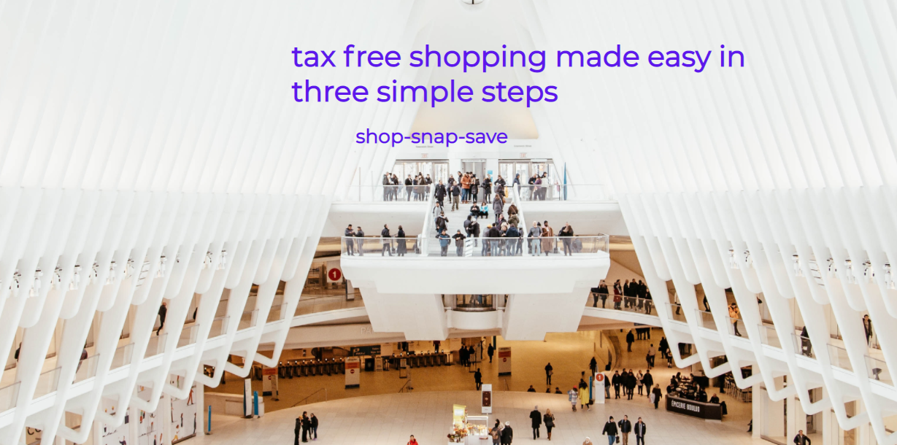

# my tax free shopping

 
 - [my tax free shopping](#my-tax-free-shopping)
  * [UX](#ux)
    + [Project Goals](#project-goals)
    + [User Stories](#user-stories)
      - [Site User](#site-user)
      - [Site Owner](#site-owner)
    + [Design Choices](#design-choices)
      - [Typography](#typography)
      - [Colors](#colors)
      - [Images](#images)
    + [Wireframes](#wireframes)
  * [Features](#features)
    + [Existing Features](#existing-features)
      - [**The header and footer**](#--the-header-and-footer--)
      - [**The Header Includes**](#--the-header-includes--)
      - [**The Footer Includes**](#--the-footer-includes--)
      - [**The Homepage**](#--the-homepage--)
      - [**The about page**](#--the-about-page--)
    + [**How it works page**](#--how-it-works-page--)
      - [Top section - How it works](#top-section---how-it-works)
      - [Bottom Image and bottom section - How it works](#bottom-image-and-bottom-section---how-it-works)
    + [**FAQ page**](#--faq-page--)
    + [**Contact**](#--contact--)
    + [**Thank you page**](#--thank-you-page--)
    + [Future Features](#future-features)
  * [Testing](#testing)
  * [Deployment](#deployment)
  * [Credits](#credits)
    + [Content](#content)
    + [Media](#media)
    + [Acknowledgments](#acknowledgments)
  

 my tax free is a fictional tax free shopping business founding by a female entrepreneur in 2021. Having worked in the tax free shopping industry she decided to set up her own refunding business. Having known all of the issues and problems in the current system she set out to provide a solution that would ensure customer satisfaction. 

 You can visit the deployed site here [here](https://lisamurphy788.github.io/mytaxfreeshopping/index.html)

 ---
 ## UX

### Project Goals 
The website will be called my tax free shopping. It promotes tax free shopping (TFS) to all non-EU tourists. Any tourist traveler visiting Ireland is entitled to claim their vat back. Currently, there are three main operators in the market, Planet, Horizon, and Innova. All of the current providers operate on a B2B model; they work directly with retailers to issue TFS sales to tourists. They work off a commission share model refund agent/retailer/tourist. My tax free shopping is giving the tourist choice to work with an agent that is only working for them to ensure they get a maximum refund cutting out large fees from retailers and agents. 
The solution will eliminate the need for long forms and long queues at the airport. The tourist/traveler will use the snap and send all receipts to my tax free shopping who will then process the claim with customs and revenue.
The main aim of the business is to remove the need for tourist/travelers to use multiple providers and also to get a higher tax refund. 
This website is for all potential customers who are non-EU tourists/travelers. 

### User Stories 
#### Site User
- As a user of this site, I want to know how tax free shopping works so I can get a refund.
- As a user of this site, I want to know how much money I will get back as this will help me decide how much I will spend. 
- As a user of this site, I want to know how much the processing fee is so I know what company to use and I get the best value.
- As a user of this site, I want to be able to contact my tax free shopping if I want to follow up on my refund or to ask a question. 
- As a user of this site, I want to be able to use this website fully from my mobile/tablet while at the airport. 
- As a user of this site, I want to find out the address of this company easily without having to fill out a contact us form. 
- As a user of this site, I want links to social media so I can check for any issues with past customers or ask any questions. 
#### Site Owner
- As a site owner, I want the customer journey to be as seamless as possible. 
- As a site owner, I want to make sure the user finds the website and they find it informative and understand the process. 
- As a site owner, I want to generate refunds for the customer.
- As a site owner, I want to highlight that there is no need to work with any other refund agent. 
 

 ### Design Choices
 #### Typography
- I used Montserrat for my fonts from Google fonts as i felt it was clear, relaxed, and read very well. 
- I also used san-serif as a fallback in the event of the font not being supported. 
- I used all lowercase from a design perspective as it gave a much more relaxed view to a customer. Most of the corporate websites that work for the retailer instead of the customer have corporate websites. I wanted my tax free shopping to be simple, easy, and customer-focused. 
- I used a link height of 2 to make it easy to read. 

Google Font Used

 #### Colors
- The main color throughout the website is purple #5E17EB. I used the color picker from the logo I created to find the #5E17EB. I used CSS gradient to create some nice radial gradients.

CSS Gradient

 #### Images
- I created mytaxfreeshopping logo from Canva. 
- All of the images used were from pixels and they are mostly airport setting images to keep with the theme of travel. 
- Any icons I used were taken from fontawesome. 
- List of images:
1. **Hero image** - used on the homepage. Image of a large shopping center showing people in all the different areas. The image is clean and crisp. It has light colors so I could use a dark text with it for good contrast. 
2. **About image** - used on the about page. Image of a guy in an airport. The majority of what the user needs to do is in the airport so a lot of my images come from there. The image shows the man from a distance by the windows on his phone. We want our customers like this in a calm area of the airport to complete their claim from their phone. 
3. **How it works** includes a picture of a lady smiling holding a ballon. My Tax Free shopping wants all their customers to be smiling and feeling good. There were also icons taken from fontawesome in this section.  
4. **FAQ image** - two airplanes in the sky. Good use of color from the sky that blends well against the purple. 
5. **Contact image** - The cliffs of Moher image is used a lot in marketing and advertising and the majority of tourists visiting Ireland would visit here so they would have some recognition. 

#### Wireframes 
The wireframes were designed using Figma. My wireframes can be found here:

[Desktop](readmeimages/wireframesdesktop.pdf)

[Tablet](readmeimages/wireframesfortablet.pdf)

[Mobile](readmeimages/wireframesformobile.pdf)

 ---
 ### Features
 ### Existing Features
 #### **The header and footer**
 - Are both present throughout all the pages. 
 - Have the same background color throughout. 

 #### **The Header Includes**
 - The my tax free shopping logo - ensures the user gets familiar with the brand. 
 - The navigation bar - allows the user to navigate through the different sections of the site easily. 

 

 #### **The Footer Includes**
 - Social media links
 
 

 #### **The Homepage**
 The homepage/landing page includes an image that has some animation. It zooms slightly on landing.
 It also includes the main slogan/messaging. 
 
 

Image of Home page

 #### **The about page**
 The about page gives the user information about how tax free shopping in Ireland works and what the rules are. It also includes an image at the top. 
 
 

Image of About page

 #### **How it works page**
 The how it works page includes information on what a customer needs to do to shop tax free. There were some icons taken from fontawesome to display the actions. 
 It also gives the benefits of using my tax free shopping to get a refund. Some background radial CSS color was used here. 
 
##### Top section - How it works

How it works page

##### Bottom Image and bottom section - How it works

How it works page

 #### **FAQ page**
 The faq page includes a list of some of the main questions a tourist might have when trying to claim a refund. I used details and summary here to display the Q&A so the page wouldn't be too long.

FAQ page

 The Faq page also includes a list of the three main Irish airports along with some google maps. 
 

 
List of Irish airports section

 #### **Contact**
 The contact page includes an image of the Cliffs of Moher it is used a lot in marketing Ireland as a destination. 
 The main item on this page is the contact form. This allows the user to send a message to my tax free directly when they have any issues or questions. 
 The page also includes the actual address, phone, and email for the company so the customer can contact them directly if they wish. 

 
Contact us page

 
#### **Thank you page**
This page appears when a customer successfully submits the contact form. It includes some text confirming they have successfully submitted and a background image. 

 
Thank you page

 ### **Future Features**
 - Add a mobile app to include geo-fencing.
 - Once the form has been submitted the user should get a confirmation email. 
 - Chat option for users
 - Refund calculator
 - Hamburger menu for mobile and tablet

 ## Testing

 The testing of this site can be found [here](TESTING.md)
 ## Deployment
 **To deploy the project**

This project is hosted in GitHub Pages

1. On the menu on the top of the project’s repository on GitHub select **Settings**.
2. Scroll down to the GitHub **Pages** section.
3. Inside that section, click on the drop-down menu under **Source** and select **Master Branch**.
4. The page refreshes automatically and the website is now deployed.
5. The link to the webpage is just in the GitHub **Pages** section down below.

Only one branch has been used for this project.

 ## Credits 
 ### Content 
Most of the text from this site came from the process that it currently operates in. 
The rules in which the system operates are available on the Irish Revenue website. (link below)

Some code was adapted from what was thought in the Love Running project. Examples of this can be seen in the;

- Website animation
- Footer with social media links 

[Revenues Website](https://www.revenue.ie/en/vat/retail-export-scheme/vat-refund-agent.aspx)

For getting a better understanding of displaying divs I watched the following video's:  
[coder-coder](https://coder-coder.com/display-divs-side-by-side/) 

For getting a better understanding of contact forms i watched the following video:
[How to build a responsive form with flexbox](https://webdesign.tutsplus.com/tutorials/building-responsive-forms-with-flexbox--cms-26767)

[To get a better understanding of Flexbox I used CSS tricks - a guide to Flexbox](https://css-tricks.com/snippets/css/a-guide-to-flexbox/ )

In order to gain a better understanding of HTML and CSS I watched the following channels that provided tutorials on both aspects some examples of these can be seen below;

- Kevin Powell [Flexbox](https://www.youtube.com/watch?v=hwbqquXww-U&list=PL4-IK0AVhVjMSb9c06AjRlTpvxL3otpUd) 

- Kevin Powell [How to create a nav bar](https://www.youtube.com/watch?v=FEmysQARWFU)

- Web Dev Simplified [Learn flexbox in 15 min](https://www.youtube.com/watch?v=fYq5PXgSsbE)
- Taversy Media [CSS crash course for absolute beginners](https://www.youtube.com/watch?v=yfoY53QXEnI&t=1307s)
- Taversy Media [How to build a responsive website](https://www.youtube.com/watch?v=p0bGHP-PXD4)
- Dev Ed [Learn flexbox in 20 min](https://www.youtube.com/watch?v=FTlczfR82mQ)
- Dev Dreamer [Complete guide to flexbox](https://www.youtube.com/watch?v=-DNLYk5uzl8)
- Keep Coding [5 CSS tricks all web developers should know](https://www.youtube.com/watch?v=wfaDzSL6ll0)
- Code Series [Faq section design](https://www.youtube.com/watch?v=yaRPsq6qDMk)

### Media
All of the pictures that i have on this site are taken from [Pixels](https://www.pexels.com/).

All of the icons for this website have been taken from [Fontawesome](https://fontawesome.com/v5.15/icons?d=gallery&p=2)

The fonts used in this website was used from [Google fonts](https://fonts.google.com/)

I used some radial gradients also which came from [CSSGradiend](https://cssgradient.io/)

I used Freeformater to run my HTML through for cleaning and indentation. [Free Formatter](https://www.freeformatter.com/)

### Acknowledgments

I would like to thank Precious Ijege for his guidance and support throughout this project.

Kasia for all her help, support, and mountains of patience.

To all my cohort for all of their help and support. Especially Thomas Guilfoyle for testing my site and providing feedback.

To Maggie Walsh and Eventyret for helping with troubleshooting my bugs. 

Sean for minding the kids and newborn baby while I get through my course.

Marie, Rebecca, Elaine, and Sarah for their help with testing. 