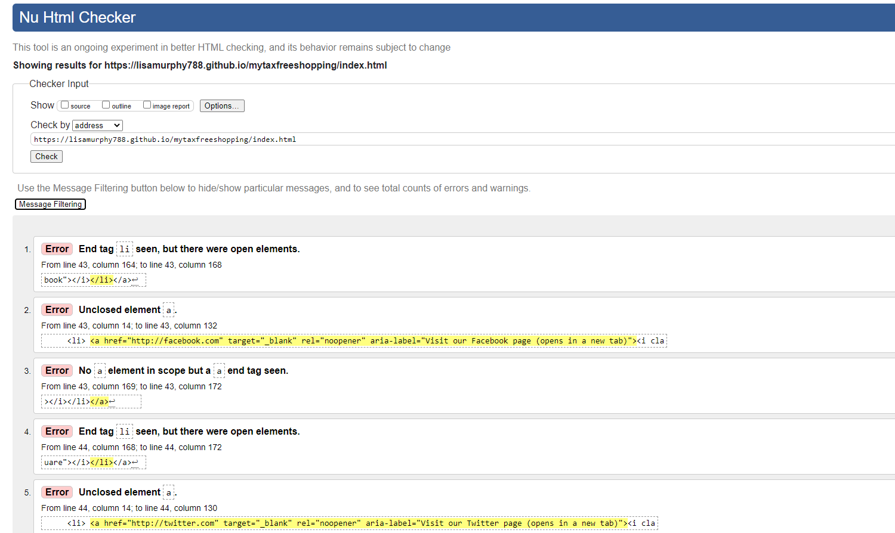
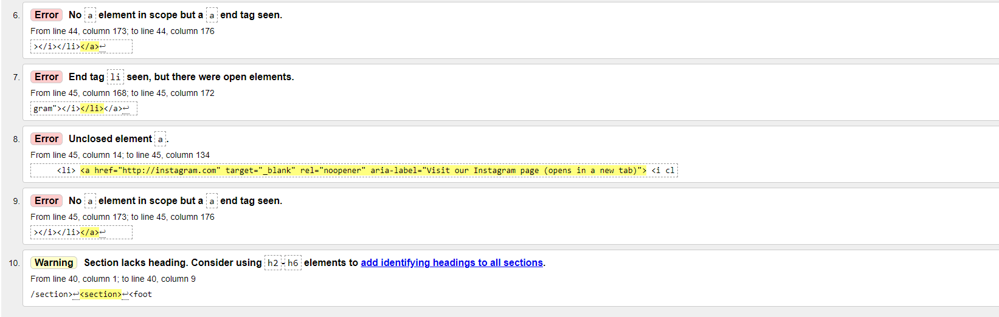

# Testing 

## Code Validator testing 

When running the code throught the validator testing it came back with 10 errors. 

### Home page 

## Home page 
All issues resolved
|Ten issues reported| Closing element on footer | Fixed  | Issues resolved|
| ---               | ---                       | ---    | ---            |
### About page
No Errors

### How it works page
|Six issues reported| Div element in UL         | Fixed  | Issues resolved|
| ---               | ---                       | ---    | ---            |

### Faq Page
#### go back to this
|Number of issues reported| google maps | inline styling| not resolved styling choice|
| ---                     | ---         | ---    | ---                        |

### Contact Page 
#### go back to this
|Number of issues reported| google maps | inline styling| not resolved styling choice|
| ---                     | ---         | ---    | ---                        |

### Thank you page
|One issue reported| Stray "section" | Removed| Issues resolved|
| ---              | ---             | ---    | ---            |

## CSS validator testing
