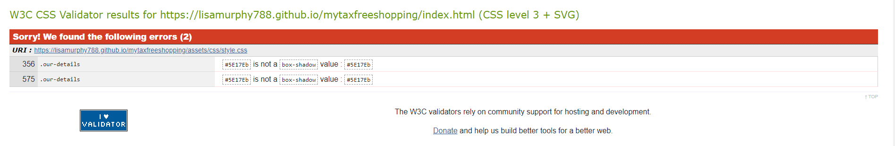

# Testing 

## Code Validator testing 

### Home page 

|Ten issues reported| Closing element on footer | Fixed  | One issue remaining|
| ---               | ---                       | ---    | ---            |

### About page
No Errors

### How it works page
|Six issues reported| Div element in UL         | Fixed  | Issues resolved|
| ---               | ---                       | ---    | ---            |

### Faq Page
#### go back to this
|22 issues reported| google maps | inline styling| not resolved styling choice|
| ---                     | ---         | ---    | ---                        |

### Contact Page 
#### go back to this
|Number of issues reported| google maps | inline styling| not resolved styling choice|
| ---                     | ---         | ---    | ---                        |

### Thank you page
No issues

## CSS validator testing
### Two issues found 

### Issues Resolved 

## Responsiveness 

- For all my responsiveness testing i used chrome dev tools
- Family and Friends also tested on different mobile devices
- ipad pro and samsung tablets were also used for testing tablets

The results are listed below;
## Home Page
|Device     |Links      |Images     |Nav bar Header/Footer|Anination zoom|
|---       |---        |---         | ---   | ---          |
|Samsung S5     |Responsive      |Responsive     | Responsive|Responsive|
|iphone 5   |Responsive |Responsive |Responsive|Responsive|
|iphone 6/7/8     |Responsive      |Responsive     |  Responsive     |Responsive|
|ipad     |Responsive      |Responsive    |Responsive       |Responsive|Responsive|
|ipad pro |Responsive      |Responsive    |Responsive       |Responsive|Responsive|
|Desktop 1024px |Responsive      |Responsive    |Responsive       |Responsive|Responsive|
## About Page 
|Device     |Links      |Images     |Nav bar Header/Footer|
|---       |---        |---         | ---   | 
|Samsung S5     |Responsive      |Responsive     | Responsive|
|iphone 5   |Responsive |Responsive |Responsive|
|iphone 6/7/8     |Responsive      |Responsive     |  Responsive     |Responsive|
|ipad     |Responsive      |Responsive    |Responsive       |Responsive|Responsive|
|ipad pro |Responsive      |Responsive    |Responsive       |Responsive|Responsive|
|Desktop 1024px |Responsive      |Responsive    |Responsive       |Responsive|Responsive|
## How it works page
|Device     |Links      |Images     |Nav bar Header/Footer|
|---       |---        |---         | ---   | 
|Samsung S5     |Responsive      |Responsive     | Responsive|
|iphone 5   |Responsive |Responsive |Responsive|
|iphone 6/7/8     |Responsive      |Responsive     |  Responsive     |
|ipad     |Responsive      |Responsive    |Responsive       |Responsive|
|ipad pro |Responsive      |Responsive    |Responsive       |Responsive|
|Desktop 1024px |Responsive      |Responsive    |Responsive       |

## FAQ page
|Device     |Links      |Images     |Nav bar Header/Footer|Airport locations (gmaps)|
|---       |---        |---         | ---   | ---          |
|Samsung S5     |Responsive      |Responsive     | Responsive|Responsive|
|iphone 5   |Responsive |Responsive |Responsive|Responsive|
|iphone 6/7/8     |Responsive      |Responsive     |  Responsive     |Responsive|
|ipad     |Responsive      |Responsive    |Responsive       |Responsive|Responsive|
|ipad pro |Responsive      |Responsive    |Responsive       |Responsive|Responsive|
|Desktop 1024px |Responsive      |Responsive    |Responsive       |Responsive|Responsive|
## Contact us page
|Device     |Links      |Images     |Nav bar Header/Footer|Contact Form| Location (gmaps)|
|---       |---        |---         | ---   | ---          | ---|
|Samsung S5     |Responsive      |Responsive     | Responsive|Responsive|Responsive|
|iphone 5   |Responsive |Responsive |Responsive|Responsive| Responsive|
|iphone 6/7/8     |Responsive      |Responsive     |  Responsive     |Responsive|Responsive|
|ipad     |Responsive      |Responsive    |Responsive       |Responsive|Responsive|
|ipad pro |Responsive      |Responsive    |Responsive       |Responsive|Responsive|
|Desktop 1024px |Responsive      |Responsive    |Responsive       |Responsive|Responsive|

## Thank you page 
|Device     |Links      |Images     |Nav bar Header/Footer|
|---       |---        |---         | ---   | 
|Samsung S5     |Responsive      |Responsive     | Responsive|
|iphone 5   |Responsive |Responsive |Responsive|
|iphone 6/7/8     |Responsive      |Responsive     |  Responsive     |
|ipad     |Responsive      |Responsive    |Responsive       |Responsive|
|ipad pro |Responsive      |Responsive    |Responsive       |Responsive|
|Desktop 1024px |Responsive      |Responsive    |Responsive       |

Images from texting can be found here ##### insert link

## Browser Compatibility Testing
### **Browser type**

 **Chrome**
 -Responsive
 
 **Internet Explorer**
 -Responsive

 **Firefox**
 -Responsive

## User Stories 
#### Site User
- As a user of this site, I want to know how tax free shopping works so I can get a refund.
  * I can find out how it works from the how it works section. 
  * Also in the about section it it goes through thresholds and limits that need to be reached in order to qualify for a refund.
  * Airport informaiton is also provided to show what airports i can get a refund
- As a user of this site, I want to know how much money I will get back as this will help me decide how much I will spend. 
  * I can see from the FAQ section how much i will get back as a %. 
  * How it works section also clearly states the vat rate of 23% and a processing fee of 5%.
- As a user of this site, I want to know how much the processing fee is so I know what company to use and I get the best value.
  * Processing fee is outlined in the How it works section and the FAQ section.
- As a user of this site, I want to be able to contact my tax free shopping if I want to follow up on my refund or to ask a question. 
  * Contact form is provided
  * My Tax Free shopping has also provided a phone and email to contact them
  * Links for social media will also give the user options to contact them directly. 
- As a user of this site, I want to be able to use this website fully from my mobile/tablet while at the airport. 
  * The site is responsive on all mobile device provided the user has internet access.
- As a user of this site, I want to find out the address of this company easily without having to fill out a contact us form. 
  * Address is listed clearly in the contact page. 

- As a user of this site, I want links to social media so I can check for any issues with past customers or to ask any questions. 
  * Social media links have been provided on the footer across all pages. 

#### Site Owner
- As a site owner, I want the customer journey to be as seamless as possible.
   * The website has provided the customer with all the information they need to have in order to claim a vat refund.  
- As a site owner, I want to make sure the user finds the website and they find it informative and understands the process. 
  * The website has given all the relevant information with regards the rules and regulations and the process in which the customer needs to follow. 
- As a site owner, I want to generate refunds for the customer.
  * Future considerations
- As a site owner, I want to highlight that there is no need to work with any other refund agent. 
  * This is very clear from the website. It is highlighted on the how it works page and the FAQ page.

## Bugs

 ### Main bug One
  - when testing the responsiveness the images would not load correctly when viewing on a device that was not a desktop. 

  ### Fix
  - In order to rectify this issue i had to remove the background image: Fixed; syntax from the CSS style sheet. This fixed the issue.

  ### Main bug two
  - When testing the responsiveness the nav bar kept dopping below the header. 

  ### Fix
  - In order to fix this i had to set the nav bar up on media queries as table header group. 

### Main bug three
- When testing responsiveness i found a horizontal scroll.

### Fix
- In order to fix this i had to add an overflow-x:hidden; code. This fixed the issue. 

### Main bug four
- When putting code through the validator test i kept getting errors regarding the iframes and the inline styling. 

### Fix one
- I removed the inline styling from the html and placed it in the css. 

### Fix two 
- removed the obsolite styling in the iframe code. 

Go Back to [README.MD](README.md)